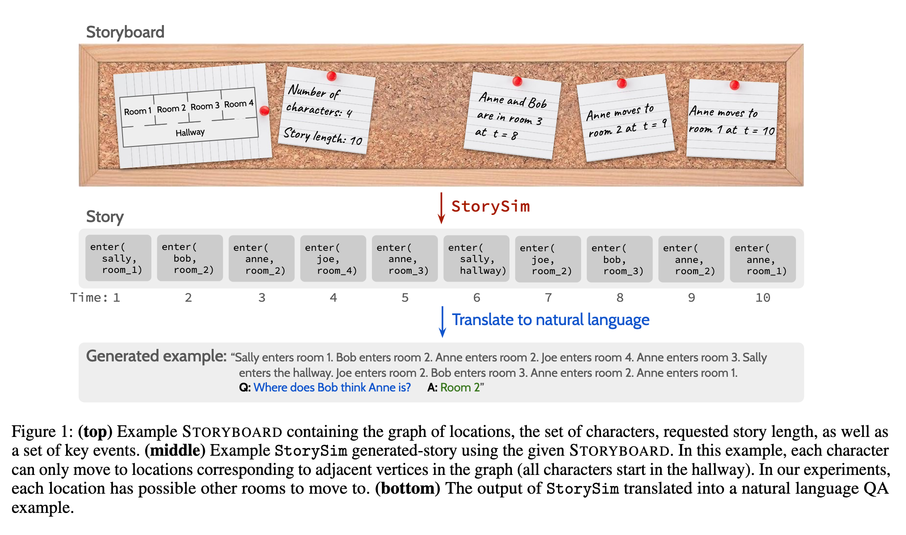

# Language Models Might Not Understand You: Evaluating Theory of Mind via Story Prompting

The following code is used in the paper titled above, find it here: 

We introduce StorySim , a programmable framework for synthetically generating stories to evaluate the theory of mind (ToM) and world modeling (WM) capabilities of large language models (LLMs). Unlike prior benchmarks that may suffer from contamination in pretraining data, StorySim  produces novel, compositional story prompts anchored by a highly controllable Storyboard , enabling precise manipulation of character perspectives and events. We use this framework to design first- and second-order ToM tasks alongside WM tasks that control for the ability to track and model mental states. Our experiments across a suite of state-of-the-art LLMs reveal that most models perform better on WM tasks than ToM tasks, and that models tend to perform better reasoning with humans compared to inanimate objects. Additionally, our framework enabled us to find evidence of heuristic behavior such as recency bias and an over-reliance on earlier events in the story. All code for generating data and evaluations is freely available. 

---

We have reproduced our exact data in the `data.zip` file for replication. Aside from that, `experiment_defs.py` sets up the first and second order experiments, feel free to add more should you need it.